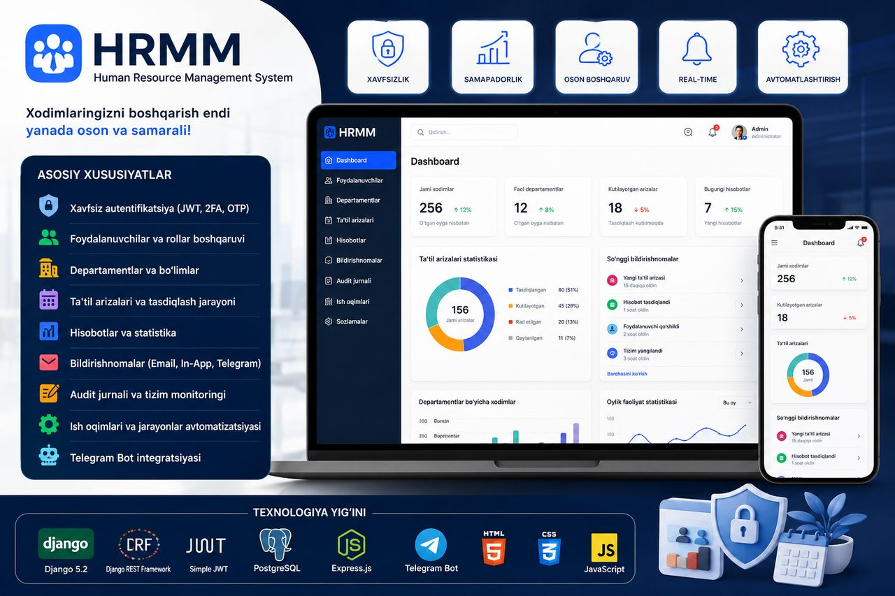
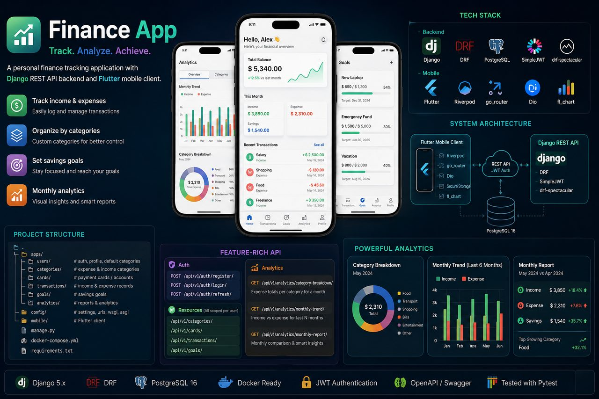

<h1 align="center">Hello 👋, I am Mamaniyozov Muhammadyusuf</h1>

  

  
  

---

## 🥷 About Me

Men **Django** va **ASP.NET** ekotizimida yuqori yuklamali, ishonchli hamda kengayuvchan (scalable) backend arxitekturalar yaratadigan **Full-Stack dasturchiman**.

* 🎓 **Ma'lumot:** Toshkent axborot texnologiyalari universiteti Samarqand filiali (AT-Servis, IT Muhandis)
* 💼 **Hozirgi faoliyat:** "RIO vs RIATM" tibbiyot muassasasida backend, ma'lumotlar bazasi va Telegram botlarni qayta tiklash hamda Karmed tizimini qo'llab-quvvatlash
* 🚀 **Asosiy maqsad:** Tizimlarni xavfsiz (JWT, 2FA, OTP) va avtomatlashtirilgan holatda production'ga tayyorlash
* 🛡️ **Qiziqishlar:** Penetratsion testlar, Linux tizimlari, Web xavfsizlik va Hackerlik madaniyati

---

## 🛠️ Technology Stack

  
  
  
  
  
  
  

---

## 📂 Featured Projects (Loyihalarim)

### 📊 [HRMM — Human Resource Management System](https://portifoliyo-production.up.railway.app/)
> Xodimlar bazasi, davomat, hisobotlar va Telegram-bot xizmatlarini birlashtirgan to'liq funksional tizim.

  

* **Texnologiyalar:** Django, Django REST Framework (DRF), PostgreSQL, Telegram Bot API
* **Imkoniyatlari:** JWT avtorizatsiya, xavfsiz autentifikatsiya va silliq interfeys monitoringi

### 💳 [Finance App (Hamyon & Analitika)](https://github.com/Mamaniyozov)
> Shaxsiy moliyaviy oqimlar va tahlillarni kuzatuvchi mustahkam backend (REST API) tizimi.

  

* **Texnologiyalar:** Django REST Framework, SimpleJWT, PostgreSQL 16, Pytest
* **Imkoniyatlari:** API endpoints orqali xarajatlar tahlili, oylik hisobotlar va xavfsiz tranzaksiyalar

---

## 📊 GitHub Stats & Trophies

  
  

  

---

## 🌐 Connect With Me

  
  
  
  

  

